# 机器人强化学习控制系统 - 详细技术文档

> 版本: 1.0  
> 日期: 2026-05-26  
> 项目路径: `e:\projects\rl_deploy`

---

## 目录

1. [项目概述](#1-项目概述)
2. [系统架构](#2-系统架构)
3. [模块详解](#3-模块详解)
4. [强化学习设计](#4-强化学习设计)
5. [消息定义](#5-消息定义)
6. [配置说明](#6-配置说明)
7. [Mujoco 训练指南](#7-mujoco-训练指南)
8. [部署与运行](#8-部署与运行)

---

## 1. 项目概述

### 1.1 项目简介

本项目是一个基于**强化学习（RL）**的四足/人形机器人双足行走控制系统，使用 ROS2 作为通信框架，ONNX Runtime 进行模型推理。系统通过手柄控制机器人行走，支持多种状态切换（待机、站立、行走、动作表演）。

### 1.2 硬件规格

- **机器人类型**: 26自由度人形机器人
- **控制频率**: 50Hz (20ms周期)
- **Policy控制关节**: 12-15个（下肢+腰部）
- **总关节数**: 26个电机

### 1.3 技术栈

| 层级 | 技术 |
|------|------|
| 通信框架 | ROS2 (Foxy/Humble) |
| 推理引擎 | ONNX Runtime |
| 训练框架 | MuJoCo + Isaac Gym (推测) |
| 编程语言 | Python 3 + C++ |
| 实时调度 | SCHED_FIFO (root权限) |

---

## 2. 系统架构

### 2.1 整体架构图

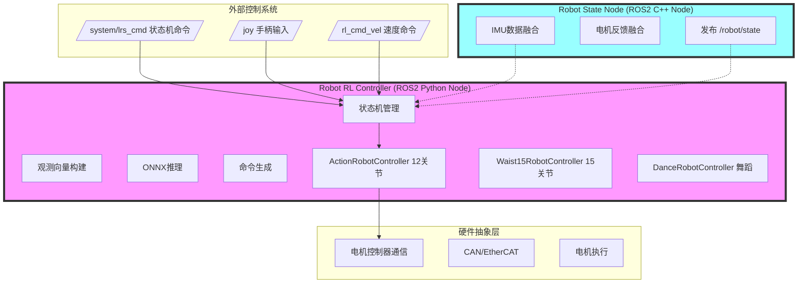

### 2.2 模块关系图

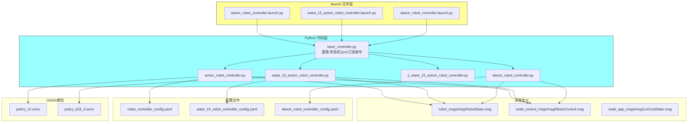

### 2.3 数据流图

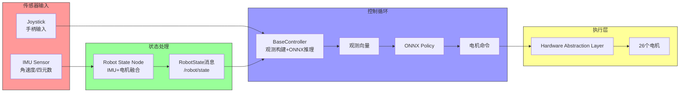

### 2.4 控制频率架构

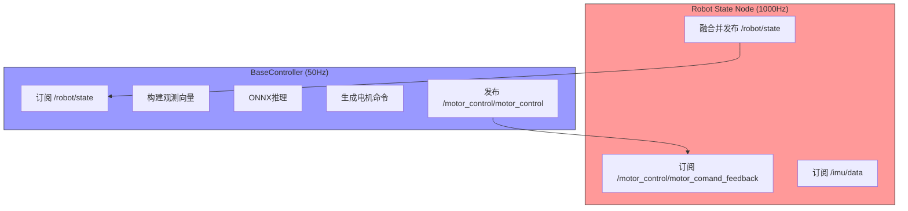

---

## 3. 模块详解

### 3.1 BaseController (基类)

**文件路径**: `src/robot_rl_controller/robot_rl_controller/base_controller.py`

#### 3.1.1 核心功能

- **状态机管理**: 实现 DISABLED → DAMPING → READY → RUNNING 状态转换
- **观测向量构建**: 从 IMU 和电机反馈提取本体感知信息
- **ONNX推理**: 调用训练好的策略模型
- **手柄命令处理**: 解析手柄输入，进行速度映射和限幅
- **QoS配置**: 为不同消息类型配置合适的QoS策略

#### 3.1.2 状态机定义

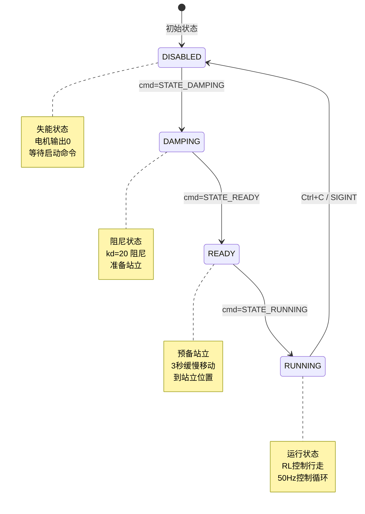

#### 3.1.3 关键类

| 类名 | 功能 |
|------|------|
| `ProprioceptionObs` | 本体观测值容器，存储角速度、重力向量、关节位置/速度 |
| `RunState` | 运行状态枚举 (IDLE, IDLE2, STANCE, TROT) |
| `SpeedCmd` | 速度命令类，包含yaw角计算和kp控制 |
| `RunTimeRecord` | 运行时间统计，记录均值/最大值/最小值 |
| `BaseController` | 控制器基类，实现通用逻辑 |

#### 3.1.4 观测向量构建

```python
# 本体观测值 (ProprioceptionObs)
self.propri_obs = {
    'base_ang_vel':    np.zeros(3),    # [wx, wy, wz] 机体角速度
    'projected_gravity': np.zeros(3),   # [gx, gy, gz] 投影重力向量
    'joint_pos':       np.zeros(n),    # 关节位置 (相对于defaultPos)
    'joint_vel':       np.zeros(n),    # 关节速度
    'base_quat':       np.zeros(4),    # 四元数 (舞蹈模式使用)
}
```

### 3.2 ActionRobotController (动作控制器)

**文件路径**: `src/robot_rl_controller/robot_rl_controller/action_robot_controller.py`

#### 3.2.1 核心功能

- 继承 `BaseController`，实现 12 关节 Policy 控制
- 支持 6 种手臂动作：挥手、握拳、比心、握手、鼓掌、飞吻
- 26 关节完整控制（下肢12 + 腰部3 + 手臂10 + 头部1）

#### 3.2.2 手臂动作状态机

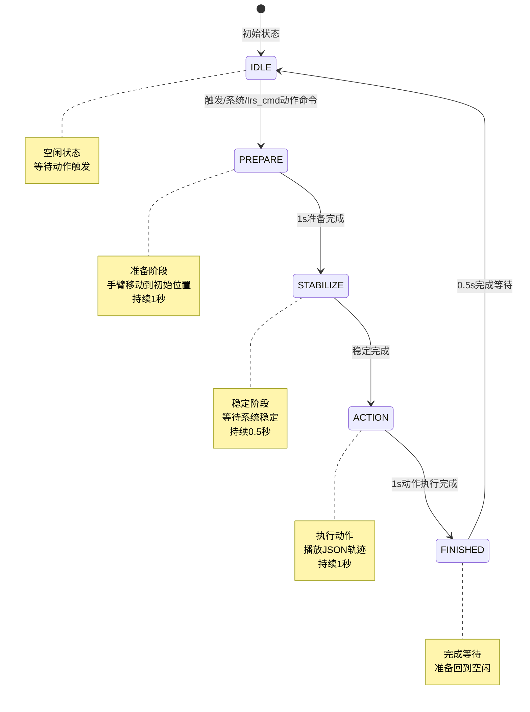

#### 3.2.3 关节映射

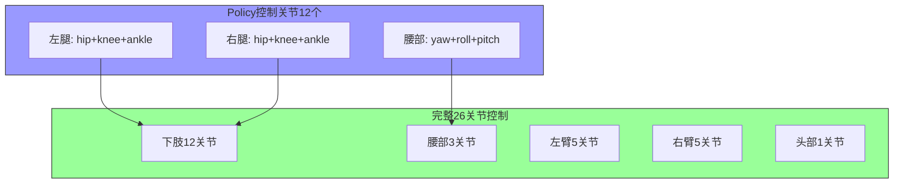

#### 3.2.4 手臂动作JSON轨迹格式

文件位置: `action/*.json`

```json
{
  "duration": 1.0,
  "joint_names": ["left_arm_0", "left_arm_1", ...],
  "positions": [[x0,y0,z0,...], [x1,y1,z1,...], ...],
  "timestamps": [0.0, 0.02, 0.04, ...]
}
```

### 3.3 Robot State Node (C++)

**文件路径**: `src/robot_state/src/robot_state_node.cpp`

#### 3.3.1 核心功能

- 订阅 IMU 数据和电机反馈数据
- 融合为统一的 `RobotState` 消息发布
- 由电机反馈触发，频率可达 1000Hz

#### 3.3.2 数据融合流程

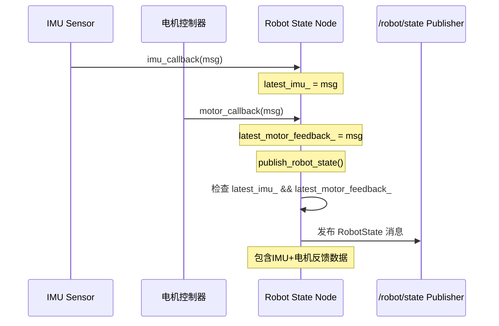

### 3.4 时序图

#### 3.4.1 系统启动时序

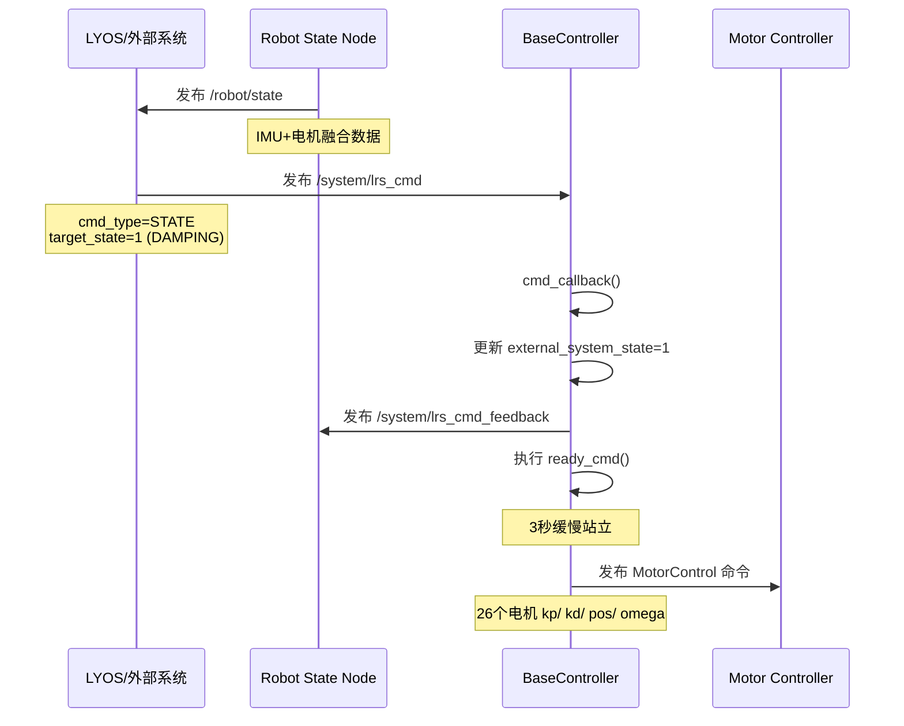

#### 3.4.2 控制循环时序 (50Hz)

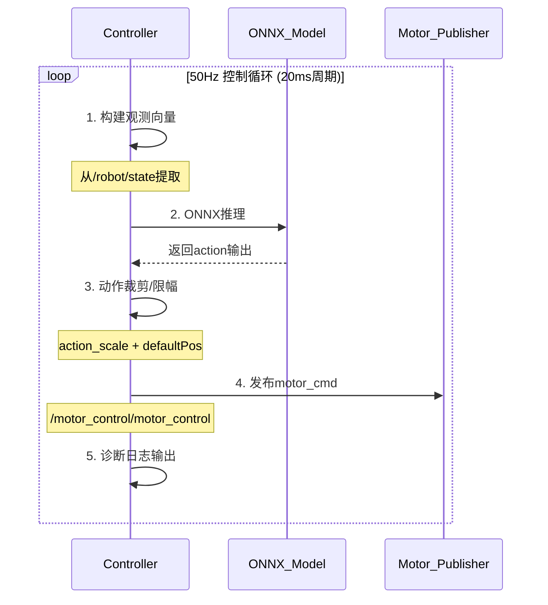

#### 3.4.3 状态切换时序

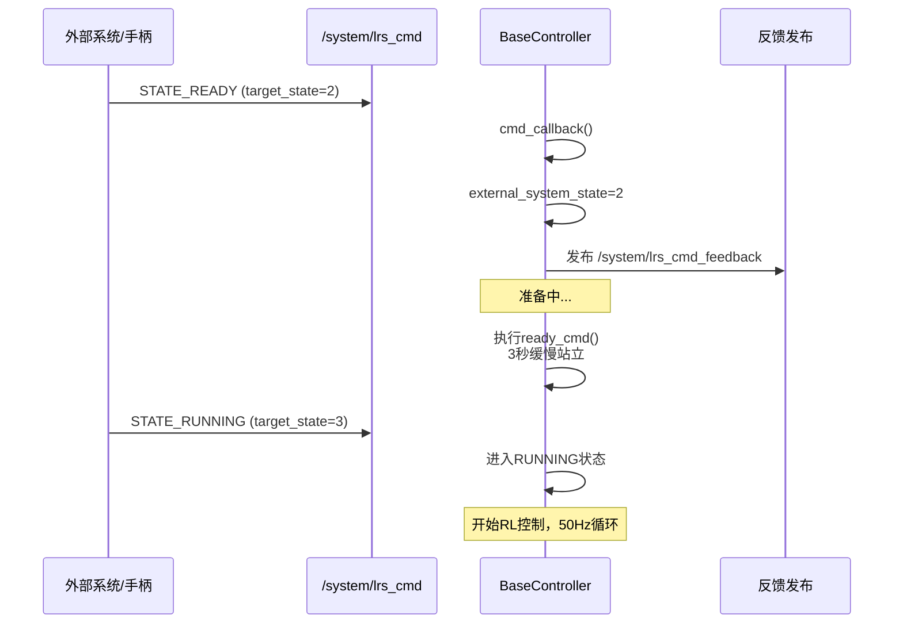

---

## 4. 强化学习设计

### 4.1 观测空间 (Observation Space)

#### 4.1.1 12关节版本 (observation_dim=47)


#### 4.1.2 15关节版本 (observation_dim=56)

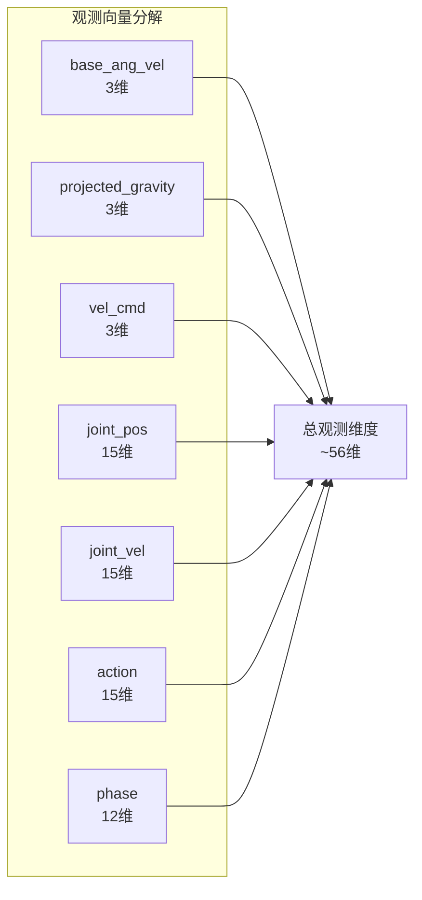

### 4.2 动作空间 (Action Space)

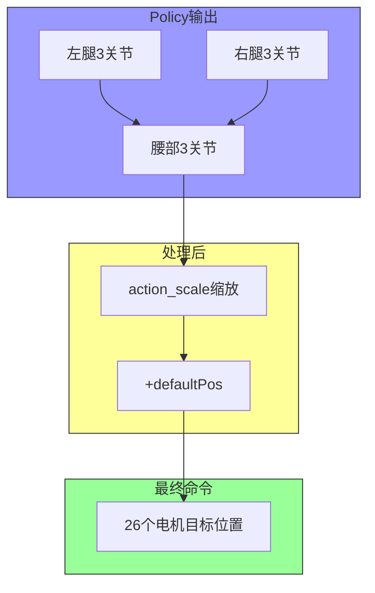

### 4.3 奖励函数设计 (推测)

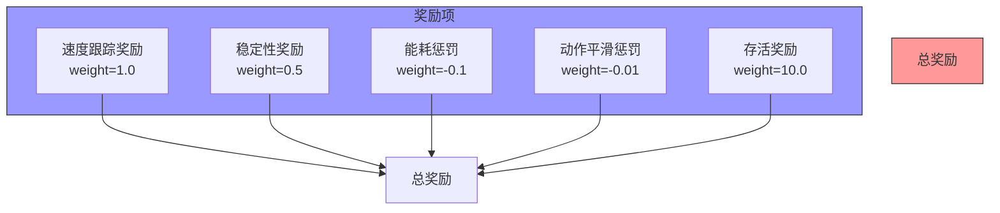

```python
# 可能的奖励函数结构
reward = (
    # 速度跟踪 (主要奖励)
    reward_velocity_tracking * 1.0
    
    # 稳定性奖励
    + reward_stability * 0.5
    
    # 能耗惩罚
    + reward_energy_efficiency * -0.1
    
    # 动作平滑惩罚
    + reward_smoothness * -0.01
    
    # 站立惩罚/奖励
    + reward_alive * 10.0
)
```

### 4.4 网络结构 (推测)

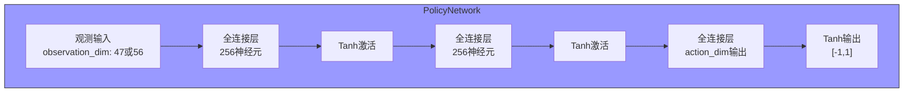

### 4.5 训练流程

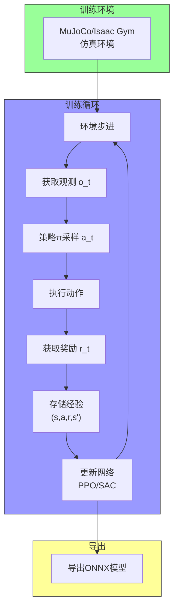

---

## 5. 消息定义

### 5.1 RobotState (robot_msgs/msg)

```
# 统一的机器人状态消息
# 包含IMU和电机反馈数据

std_msgs/Header header
sensor_msgs/Imu imu
node_control_msgs/MotorCommandFeedback motor_feedback
```

### 5.2 MotorControl (node_control_msgs/msg)

```
# 电机控制命令

std_msgs/Header header
uint32 seq_num
MotorCommand[] cmd  # 26个电机的命令数组

# MotorCommand 结构:
uint16 kp              # 比例增益
uint16 kd              # 微分增益
float32 position_des   # 目标位置 (rad)
float32 omega_des      # 目标速度 (rad/s)
int16 torque_des       # 目标扭矩 (Nm)
uint16 reserved        # 保留字段
```

### 5.3 LrsCmdState (node_app_msgs/msg)

```
# 外部系统状态机命令

std_msgs/Header header

# 命令类型
uint32 CMD_TYPE_STATE_CHANGE = 0
uint32 CMD_TYPE_MODE_CHANGE = 1
uint32 cmd_type

# 状态定义
uint32 STATE_DISABLED = 0
uint32 STATE_DAMPING = 1
uint32 STATE_READY = 2
uint32 STATE_RUNNING = 3

uint32 current_state
uint32 target_state

# 模式定义
uint32 MODE_DEFAULT = 0
uint32 MODE_DANCE = 1

uint32 current_mode
uint32 target_mode
```

### 5.4 LrsCmdStateFeedback

```
# 状态切换反馈 (与状态命令共用同一话题)

std_msgs/Header header
uint32 current_state
uint32 current_mode
```

### 5.5 Topic 列表

| Topic | 方向 | 用途 |
|-------|------|------|
| `/robot/state` | 发布 | 融合IMU+电机状态 |
| `/motor_control/motor_control` | 发布 | 电机控制命令 |
| `/motor_control/motor_comand_feedback` | 订阅 | 电机反馈 |
| `/imu/data` | 订阅 | IMU数据 |
| `/joy` | 订阅 | 手柄输入 |
| `/rl_cmd_vel` | 订阅 | 速度命令 |
| `/system/lrs_cmd` | 订阅/发布 | 状态机命令 |
| `/system/lrs_cmd_feedback` | 发布 | 状态反馈 |
| `/diagnostics` | 发布 | 诊断信息 |

---

## 6. 配置说明

### 6.1 配置文件结构

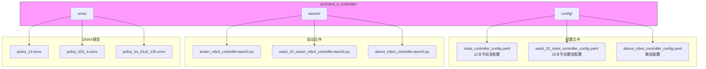

### 6.2 关键参数说明

#### 6.2.1 控制频率

```yaml
parameters:
  RLFrequency: 50  # Hz - 控制循环频率
  yawKp: 0.8       # yaw方向PID增益
```

#### 6.2.2 电机配置

```yaml
parameters:
  robotJointNum: 26        # 总关节数
  policyJointNum: 12       # Policy控制关节数
  policy_joint_indices: [0,1,2,...]  # Policy映射到硬件索引
```

#### 6.2.3 PD增益

```yaml
parameters:
  kps: [680, 450, ...]   # 比例增益 (26个)
  kds: [40, 25, ...]     # 微分增益 (26个)
```

#### 6.2.4 默认位置

```yaml
parameters:
  defaultPos: [-0.2, 0.0, ...]  # 默认站立位置 (26个)
  readyPos: [-0.2, -0.3, ...]   # 预备站立位置 (26个)
```

#### 6.2.5 速度限制

```yaml
parameters:
  CommandLimit: [0.8, 0.5, 0.75]  # [vx_max, vy_max, wz_max]
  CommandOffset: [0, 0, 0]         # 速度偏置
  vel_ramp_decel: [0.6, 0.5]      # 减速斜率
```

---

## 7. Mujoco 训练指南

### 7.1 环境搭建

#### 7.1.1 安装 MuJoCo

```bash
# 安装 MuJoCo
pip install mujoco

# 或使用 Isaac Gym (推荐用于并行训练)
pip install isaacgym
```

#### 7.1.2 机器人URDF/MJCF

```xml
<!-- robot.xml (MJCF 示例) -->
<mujoco>
  <compiler angle="radian" autolimits="true"/>
  
  <asset>
    <mesh name="body" file="body.stl"/>
  </asset>
  
  <worldbody>
    <body name="robot_base" pos="0 0 0.5">
      <!-- 26个关节定义 -->
      <!-- 左腿 -->
      <joint name="left_hip" type="hinge" axis="0 0 1" range="-1.5 1.5"/>
      <joint name="left_knee" type="hinge" axis="0 1 0" range="-0.2 2.0"/>
      <joint name="left_ankle" type="hinge" axis="0 1 0" range="-1.0 1.0"/>
      
      <!-- 右腿 -->
      <joint name="right_hip" type="hinge" axis="0 0 1" range="-1.5 1.5"/>
      <joint name="right_knee" type="hinge" axis="0 1 0" range="-0.2 2.0"/>
      <joint name="right_ankle" type="hinge" axis="0 1 0" range="-1.0 1.0"/>
      
      <!-- 腰部 -->
      <joint name="waist_yaw" type="hinge" axis="0 0 1" range="-1.0 1.0"/>
      <joint name="waist_roll" type="hinge" axis="0 1 0" range="-0.5 0.5"/>
      <joint name="waist_pitch" type="hinge" axis="0 1 0" range="-0.5 0.5"/>
      
      <!-- 手臂... -->
    </body>
  </worldbody>
  
  <actuator>
    <!-- 26个电机定义 -->
    <position name="left_hip" joint="left_hip" kp="680" kv="40"/>
  </actuator>
</mujoco>
```

### 7.2 训练脚本结构

```python
# train_policy.py (示例)
import mujoco
import numpy as np
import torch
import torch.nn as nn
from torch.distributions.normal import Normal

class PolicyNetwork(nn.Module):
    """策略网络"""
    def __init__(self, obs_dim, act_dim, hidden_size=256):
        super().__init__()
        self.actor = nn.Sequential(
            nn.Linear(obs_dim, hidden_size),
            nn.Tanh(),
            nn.Linear(hidden_size, hidden_size),
            nn.Tanh(),
            nn.Linear(hidden_size, act_dim),
            nn.Tanh(),  # 输出 [-1, 1]，后续缩放
        )
        
    def forward(self, obs):
        return self.actor(obs)


class RewardManager:
    """奖励管理器"""
    def __init__(self):
        self.weights = {
            'velocity': 1.0,
            'stability': 0.5,
            'energy': -0.1,
            'smoothness': -0.01,
            'alive': 10.0,
        }
    
    def compute(self, env, action, step):
        reward = 0.0
        
        # 速度跟踪奖励
        vel_error = (env.velocity - target_velocity) ** 2
        reward += self.weights['velocity'] * vel_error
        
        # 稳定性奖励 (防止摔倒)
        gravity_projection = abs(env.gravity_vector[2])
        reward += self.weights['stability'] * gravity_projection
        
        # 能耗惩罚
        torque_energy = np.sum(action ** 2)
        reward += self.weights['energy'] * torque_energy
        
        # 动作平滑惩罚
        if hasattr(self, 'prev_action'):
            action_diff = np.sum((action - self.prev_action) ** 2)
            reward += self.weights['smoothness'] * action_diff
        self.prev_action = action
        
        # 存活奖励
        reward += self.weights['alive'] * (step < max_steps)
        
        return reward
```

### 7.3 观测向量构造

```python
def compute_observations(env):
    """
    构造与部署一致的观测向量
    
    部署观测维度: 47 (12关节) 或 56 (15关节)
    """
    # 1. 角速度 (3维)
    base_ang_vel = env.angular_velocity  # [wx, wy, wz]
    
    # 2. 重力向量 (3维)
    projected_gravity = env.gravity_vector
    
    # 3. 速度命令 (3维) - 来自手柄/导航
    vel_cmd = np.array([vx_cmd, vy_cmd, wz_cmd])
    
    # 4. 关节位置 (n维) - 相对于defaultPos
    joint_pos = env.joint_positions - default_pos
    
    # 5. 关节速度 (n维)
    joint_vel = env.joint_velocities
    
    # 6. 上一时刻动作 (n维)
    prev_action = env.prev_action
    
    # 7. 相位信号 (可选)
    phase = compute_phase(step)
    
    # 拼接
    observation = np.concatenate([
        base_ang_vel * 0.25,           # 角速度缩放
        projected_gravity,
        vel_cmd * vel_cmd_scale,        # 速度命令缩放
        joint_pos,
        joint_vel * 0.05,               # 关节速度缩放
        prev_action,
        phase,
    ])
    
    return observation
```

### 7.4 导出ONNX

```python
# export_onnx.py
import torch
import onnx
import onnxruntime as ort

def export_to_onnx(policy, obs_dim, act_dim, output_path):
    """导出策略网络为ONNX格式"""
    
    # 创建示例输入
    dummy_input = torch.randn(1, obs_dim)
    
    # 导出
    torch.onnx.export(
        policy,
        dummy_input,
        output_path,
        opset_version=11,
        input_names=['observation'],
        output_names=['action'],
        dynamic_axes={
            'observation': {0: 'batch_size'},
            'action': {0: 'batch_size'},
        }
    )
    
    # 验证
    onnx_model = onnx.load(output_path)
    onnx.checker.check_model(onnx_model)
    print(f"ONNX模型已导出到: {output_path}")
    
    # 测试推理
    ort_session = ort.InferenceSession(output_path)
    output = ort_session.run(None, {'observation': dummy_input.numpy()})
    print(f"推理测试: 输入形状 {dummy_input.shape}, 输出形状 {output[0].shape}")
```

### 7.5 训练最佳实践

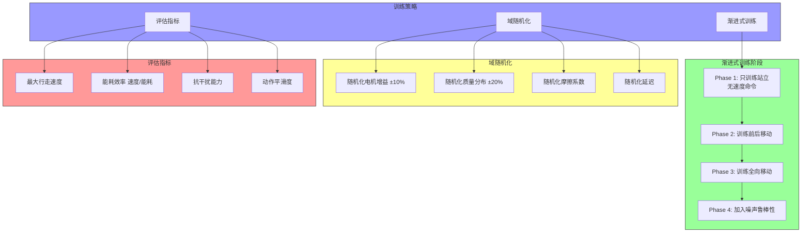

---

## 8. 部署与运行

### 8.1 构建流程

```bash
# 1. 设置ROS2环境
source /opt/ros/foxy/setup.bash

# 2. 构建工作空间
cd /path/to/workspace
colcon build --packages-select robot_rl_controller robot_state node_control_msgs robot_msgs node_app_msgs

# 3. 加载环境
source install/setup.bash
```

### 8.2 启动方式

#### 8.2.1 标准12关节模式

```bash
ros2 launch robot_rl_controller action_robot_controller.launch.py
```

#### 8.2.2 15关节含腰部模式

```bash
ros2 launch robot_rl_controller waist_15_action_robot_controller.launch.py
```

#### 8.2.3 舞蹈模式

```bash
ros2 launch robot_rl_controller dance_robot_controller.launch.py
```

### 8.3 状态切换命令

```bash
# 切换到阻尼状态 (STATE_DAMPING = 1)
ros2 topic pub /system/lrs_cmd node_app_msgs/msg/LrsCmdState \
  "{header: {stamp: {sec: 0, nanosec: 0}}, cmd_type: 0, current_state: 0, target_state: 1, current_mode: 0, target_mode: 0}"

# 切换到预备站立 (STATE_READY = 2)
ros2 topic pub /system/lrs_cmd node_app_msgs/msg/LrsCmdState \
  "{header: {stamp: {sec: 0, nanosec: 0}}, cmd_type: 0, current_state: 1, target_state: 2, current_mode: 0, target_mode: 0}"

# 切换到运行状态 (STATE_RUNNING = 3)
ros2 topic pub /system/lrs_cmd node_app_msgs/msg/LrsCmdState \
  "{header: {stamp: {sec: 0, nanosec: 0}}, cmd_type: 0, current_state: 2, target_state: 3, current_mode: 0, target_mode: 0}"
```

### 8.4 速度命令

```bash
# 发布速度命令
ros2 topic pub /rl_cmd_vel geometry_msgs/msg/Twist \
  "{linear: {x: 0.3, y: 0.0, z: 0.0}, angular: {x: 0.0, y: 0.0, z: 0.0}}"
```

### 8.5 监控

```bash
# 查看机器人状态
ros2 topic echo /robot/state

# 查看电机命令
ros2 topic echo /motor_control/motor_control --once

# 查看诊断信息
ros2 topic echo /diagnostics

# 查看日志
ros2 log
```

### 8.6 实时性配置

```bash
# 绑定CPU核心
# 在 main() 中已实现:
# os.sched_setaffinity(0, {4})  # 绑定到核心4

# 设置SCHED_FIFO实时调度
# 需要root权限:
sudo ros2 launch robot_rl_controller action_robot_controller.launch.py
```

---

## 附录

### A. 文件结构总览

```
rl_deploy/
├── src/
│   ├── robot_rl_controller/
│   │   ├── package.xml
│   │   ├── setup.py
│   │   ├── config/
│   │   │   ├── robot_controller_config.yaml
│   │   │   ├── waist_15_robot_controller_config.yaml
│   │   │   └── dance_robot_controller_config.yaml
│   │   ├── launch/
│   │   │   ├── action_robot_controller.launch.py
│   │   │   ├── waist_15_action_robot_controller.launch.py
│   │   │   └── dance_robot_controller.launch.py
│   │   ├── onnx/
│   │   │   ├── policy_12.onnx
│   │   │   ├── policy_d15_4.onnx
│   │   │   └── ...
│   │   └── robot_rl_controller/
│   │       ├── base_controller.py
│   │       ├── action_robot_controller.py
│   │       ├── waist_15_action_robot_controller.py
│   │       └── s_waist_15_action_robot_controller.py
│   ├── robot_state/
│   │   ├── package.xml
│   │   └── src/
│   │       └── robot_state_node.cpp
│   ├── robot_msgs/
│   │   └── msg/
│   │       └── RobotState.msg
│   ├── node_control_msgs/
│   │   └── msg/
│   │       ├── MotorControl.msg
│   │       └── MotorCommand.msg
│   └── node_app_msgs/
│       └── msg/
│           ├── LrsState.msg
│           ├── LrsCmdState.msg
│           └── LrsCmdStateFeedback.msg
├── action/
│   ├── wave_joint_path.json
│   ├── clap_joint_path.json
│   └── ...
└── install/
    └── ...
```

### B. 电机关节编号

```
26个电机编号:
  [0-11]:   Policy控制关节 (12或15个)
  [12-25]:  未控制关节 (手臂、头部等)

具体映射请参考配置文件中的 policy_joint_indices
```

### C. 版本历史

| 版本 | 日期 | 说明 |
|------|------|------|
| 1.0 | 2026-05-26 | 初始文档 |

---

*文档结束*